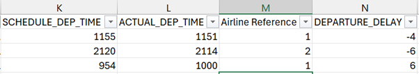
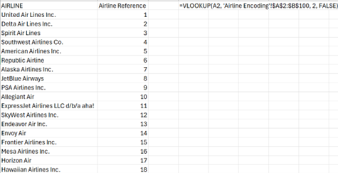
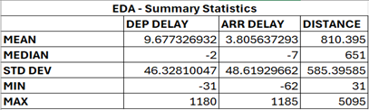
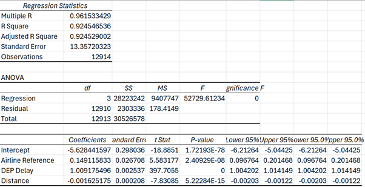
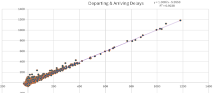
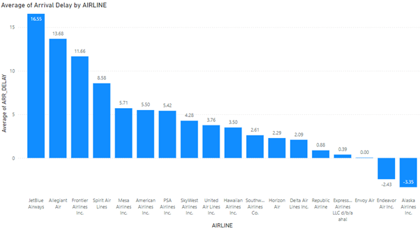
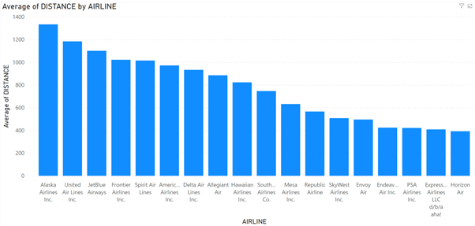

# Data-Science-Project
Research Question: Which factors, including departure delay, airline, and flight distance, most significantly influence arrival delay times?
# Exec Summary
This project investigates the factors influencing arrival delay times for flights, focusing on departure delay, airline and flight distance. Using a dataset from Kaggle covering flight delays and cancellations from 2019 to 2023, we performed exploratory data analysis and linear regression. Findings suggested a strong positive correlation between departure delays and arrival delays, indicating that delays at departure significant impact arrival times slow down operations. Flight distance shows a positive relational with arrival delay but it’s less significant. This analysis provides valuable insight into key factors driving flight delays and offers a foundation for further research and development.
# Introduction
Flight delays are a critical issue in the aviation industry, affecting passengers, airlines and overall operational efficiency (Deshpande & Arikan, 2012). Delays can lead to additional operational costs, passenger dissatisfaction, and logistical challenges for airports. Previous research has found departure delays often have a cascading effect, significantly increasing the likelihood of arrival delays (Hansen & Zhang, 2020). However, less research has been done on the distance of flights along with specific airlines and this project aims to address these gaps to see if various factors play a role in arrival delays. 
# Methodology

## Data Collection & Preparation
The dataset used for this project was sourced from Kaggle and it entailed a comprehensive collection of flight delays data spanning from 2019 to 2023. The dataset contains detailed information on various aspects of flight operations, including departure and arrival time, origin and destination, airline identifiers and distance travelled. 

To facilitate an easier understanding, it was necessary to rename some columns in the dataset to clearly label them making it simpler to reference throughout the analysis (Figure 10). Columns were rearranged which needed to do be for the regression analysis alongside making the data clearer to view and understand.

As the dataset had over a million rows, random sampling was performed to reduce the data to a more manageable size as excel struggles with large datasets and often slows down the process (Guerrero et al, 2019). I selected 12915 rows randomly to ensure the sample remained representative of the overall dataset. Missing values were examined and removed due to irrelevance to the analysis, I checked for duplicates using the ‘Remove Duplicates’ function on excel. Data encoding is a crucial step when preparing data for linear regression and as the airline column was categorical data, it needed to be converted to a numerical format (Hamadani et al, 2023). A separate sheet was created called ‘Airline Encoding’ listing the airlines and given each a number and a VLOOKUP formula was created to link it back to the main table (Figure 11).
# image

# Analysis
Linear regression is ideal for quantifying the relationship between continuous variables, along with providing coefficients that measure strength and direction of these variables (James, et al 2023). This project has a focus on how departure delays, flight distance and airlines impact arrival delays, making it a preference to other methods of analysis. The drawbacks of linear regression are that it’s sensitive to outliers and can affect the regression line and skew results (Seber & Lee, 2012).

To understand the dataset better, some key descriptive statistics such as mean, median and standard deviation were calculated for departing & arriving delays and distance (Figure 12). On average, departing flights were delayed by 9.7 minutes in comparison to arriving flights being 3.8 minutes delayed. This suggests that delays are being slightly mitigated during the flight and could be due to operational adjustments such as flight paths, speeds or air traffic control assisting with routing.
# image

Correlation analysis was conducted to assess the relationship between departure delays and arrival delays (Figure 13). Results from this found a very strong positive relationship indicating that departure delays are a significant predictor of arrival delays.
# image

By enabling the Data Analysis ToolPak feature on Excel, a linear regression analysis was performed due to the 3 independent variables in the data (Figure 14). The arrival delay was the dependent variable and the departure delay, flight distance and encoded airline were the independent variables for this study.

# image

There is a strong correlation coefficient of 0.96, indicating a very strong relationship between the independent variables and the dependent variable. Followed by a strong R square score which shows that 92.45% of the variance in the arrival delay time can be explained by the independent variables. The coefficient indicated that for every minute increase in departure delay, the arrival delay increased by about 1.009 minutes which is expected. The coefficient for distance suggests that for every mile in distance the arrival delay slightly decreases, however the effect is very minimal. A reason for this is more time to change flight path and save time. 

Visualization & Dashboards

The first visualization is a scatter plot with a linear regression line, clearly demonstrating a strong relationship between departure delays and arrival delays (Figure 15). The R squared further backs up the point of a strong relationship.
# image

Power BI was utilized to showcase the airlines with the highest arrival delays (Figure 16). JetBlue Airways had the highest delay time in comparison to Alaska Airlines who typically arrived early on average. This information could be fed back to airlines and work could be done to ipove operational efficient.
# image

Interesting the airline with the least average delay times, also had the largest average flight time which suggests that due to long distance flights, the airline might have optimized its operations for long haul flight due to better logistics, experience cred or more reliable aircrafts (Figure 17).
# image

The analysis revealed a strong correlation between departure delays and arrival delays which can be seen on the scatter plot with the trendline. Overall, these insights highlight the importance of operational strategies and scheduling practices in mitigating delays, warranting further investigation into the factors contributing to these efficiencies.

Discussion
This project identified significant patterns in the relationship between departure delays, flight distance and arrival delays. Notably, the strong correlation between departure and arrival delays underscores the importance of managing departure times to begin with. An interesting finding found the airline with the highest average distance had the lowest average arrival delays suggesting effective long-haul flight management. This project has stated its limitations and there are potential areas for further research. One may be to use a SQL database which would be more efficient than excel for handling large datasets. Ethical considerations are important for this project as it is important to present findings without bias towards airlines. 

Future research could include weather delays, air traffic and airport congestion to understand their impact on delays, thus providing a more comprehensive view. Research over an extended period may be beneficial as it may be able to capture trends over time and include seasonality. This will help with generalizability and validating findings. Machine learning models like Python or R may be implemented in the future to identify complex patterns not captured by linear regression. 

# ReferenCivil Aviation Authority (2023) Airport accessibility report – 2022/23. Available at: https://www.caa.co.uk/publication/download/20536 (Accessed: 18 August 2024). 

Deshpande, V. and Arıkan, M., 2012. The impact of airline flight schedules on flight delays. Manufacturing & Service Operations Management, 14(3), pp.423-440.

Graham, A., 2023. Managing airports: An international perspective. Routledge.

Guerrero, H., Guerrero, R. and Rauscher, 2019. Excel data analysis. Springer International Publishing.

Hamadani, A., Ganai, N.A. and Bashir, J., 2023. Artificial neural networks for data mining in animal sciences. Bulletin of the National Research Centre, 47(1), p.68.

Hansen, M., & Zhang, Y. (2020). The cascading effects of flight delays in the U.S. domestic airline network. Transportation Research Part E: Logistics and Transportation Review, 142, 102068.

Hargreaves, B.R. and McWilliams, T.P., 2010. Polynomial trendline function flaws in Microsoft Excel. Computational Statistics & Data Analysis, 54(4), pp.1190-1196.

Hyndman, R.J. and Athanasopoulos, G., 2018. Forecasting: principles and practice. OTexts.

International Air Transport Association (IATA). (2020). Accessibility in Aviation: Ensuring the Air Transport System is Open to All. IATA.

James, G., Witten, D., Hastie, T., Tibshirani, R. and Taylor, J., 2023. Linear regression. In An introduction to statistical learning: With applications in python (pp. 69-134). Cham: Springer International Publishing.

Marr, B., 2016. Big data in practice: how 45 successful companies used big data analytics to deliver extraordinary results. John Wiley & Sons.

McFedries, P., 2013. Excel 2013 Formulas and Functions. Que Publishing.

Montgomery, D.C., Peck, E.A. and Vining, G.G., 2021. Introduction to linear regression analysis. John Wiley & Sons.

Ravishankar, T. Nadana, and Komarasamy, G. (2022) 'Application of Time Series Analysis for Better Decision-Making in Business', Technoarete Transactions on Intelligent Data Mining and Knowledge Discovery

Seber, G.A. and Lee, A.J., 2012. Linear regression analysis. John Wiley & Sons.

Wensveen, J. G. (2016). Air Transportation: A Management Perspective (8th ed.). Ashgate Publishing

Yeoh, K. A., & Chan, A. P. (2018). Seasonal Trends in Air Passenger Traffic: A Comparative Study. Journal of Transport Geography, 70, 88-97.
ces
